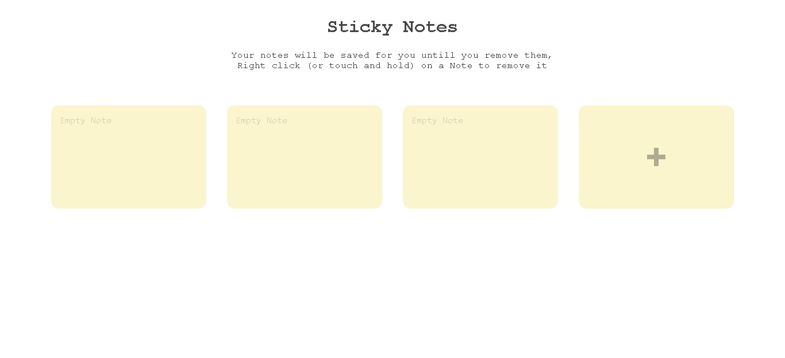

# Sticky Notes App

This is my 46 Project in the 50 project Challange to practice vanilla JavaScript, a Responsive Sticky Notes App that uses the LocalStorgae to save the note you create

### Screenshot

### Links

- [Live Site URL](https://husamasaad.github.io/sticky-notes/)

## My process

### Built with

- Semantic HTML5 markup
- CSS custom properties
- Flexbox
- Mobile-first workflow
- EC6 vanilla Javascript

## Author

- github Profile - [Husam Asaad](https://github.com/husamasaad)
